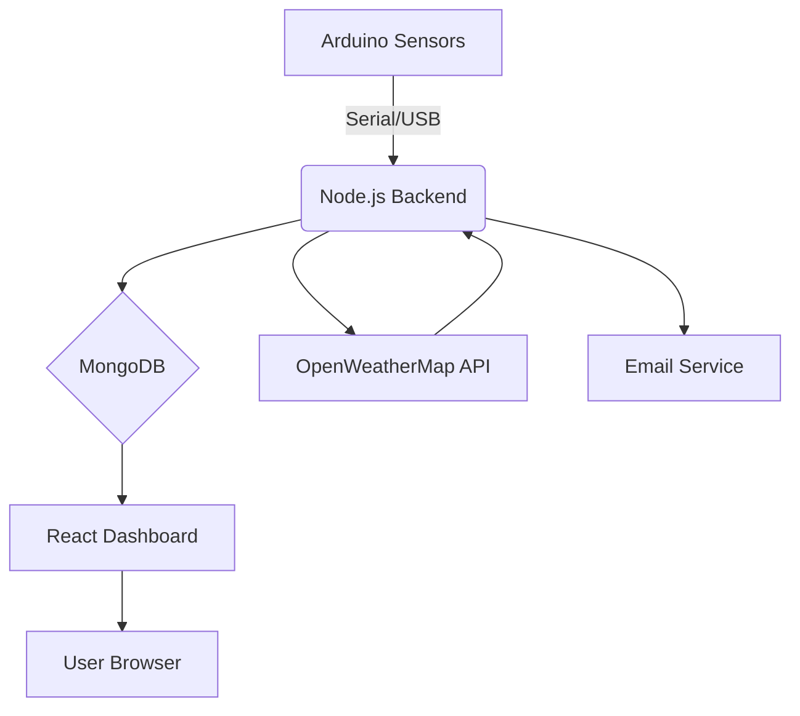

# Air Quality Monitoring System 🌬️

[](https://opensource.org/licenses/MIT)
[](https://react.dev/)
[](https://nodejs.org/)

A full-stack IoT system for real-time air quality monitoring with Arduino sensors, Node.js backend, and React dashboard. Provides personalized health alerts and historical data analysis.


## Features ✨

- 📊 Real-time sensor data visualization
- ⚠️ Threshold-based email alerts with health recommendations
- 📈 Historical data trends (24h/7d/30d)
- 🩺 Health condition-aware notifications
- 📍 Multi-device support with GPS tracking
- 🔧 Sensor calibration tracking system
- 📱 Responsive web interface

## System Architecture 🏗️



### Hardware Requirements 🛠️

- Arduino Uno Rev3
- Sensors:
  - MQ-7 (CO)
  - MQ-135 (Air Quality)
  - MQ-4 (Methane)
- 1.3" OLED Display
- USB Cable/Breadboard

### Software Requirements 💻

- Node.js 18.x
- MongoDB 6.x
- Arduino IDE 2.x
- Python 3.10+ (for serial communication)

## Installation & Setup ⚙️

**Backend Setup**
```bash
git clone https://github.com/yourusername/air-quality-system.git
cd air-quality-system/backend
# Install dependencies
npm install
# Configure environment
cp .env.example .env
# Edit .env with your credentials
# Start server
npm run dev
```

**Frontend Setup**
```bash
cd ../frontend
# Install dependencies
npm install
# Start development server
npm run dev
```

### Arduino Setup

1. Install required libraries:
   - Adafruit SSD1306
   - Adafruit GFX Library
   - DHT sensor library
2. Upload arduinoCode.cpp to your device
3. Verify serial port communication:
   ```bash
   # Linux/Mac
   ls /dev/tty.*
   # Windows
   # Check Device Manager for COM ports
   ```

## Database Schema 🗃️


Key Collections:
- SensorData - Raw sensor readings
- EmailSubscription - User alert preferences
- Device - Arduino device configurations
- HealthRecommendation - Medical guidelines

## API Documentation 📚

### GET /api/weather
```json
{
  "aqi": 45,
  "temperature": 28.5,
  "humidity": 65,
  "pm25": 12.3,
  "pm10": 24.7,
  "co": 1.2
}
```

### POST /api/alerts/subscribe
```json
{
  "email": "user@example.com",
  "threshold": 100,
  "healthConditions": {
    "hasAsthma": true,
    "conditionSeverity": "moderate"
  }
}
```

[Full API Documentation](#)

## Contributing 🤝

1. Fork the repository
2. Create your feature branch:
   ```bash
   git checkout -b feature/amazing-feature
   ```
3. Commit your changes:
   ```bash
   git commit -m 'Add some amazing feature'
   ```
4. Push to the branch:
   ```bash
   git push origin feature/amazing-feature
   ```
5. Open a Pull Request

## Troubleshooting 🔧

**Sensor Data Not Updating**
- Verify serial port connection
- Check Arduino power supply
- Confirm MongoDB service is running

**Email Alerts Not Sending**
- Verify SMTP credentials in .env
- Check spam folder
- Ensure subscription is active in database

**Dashboard Display Issues**
- Clear browser cache
- Confirm CORS settings in backend
- Check network connectivity

## License 📄

This project is licensed under the MIT License - see the LICENSE file for details.

## Acknowledgments 🙏

- OpenWeatherMap for environmental data
- Adafruit for OLED display libraries
- EPA for AQI calculation guidelines

## Project Maintainers

Arijit Roy | Ittekhar Mahin Abir | Raheta Sadeka

CSE 342 - IoT Based Project Development  
East Delta University, Chattogram
